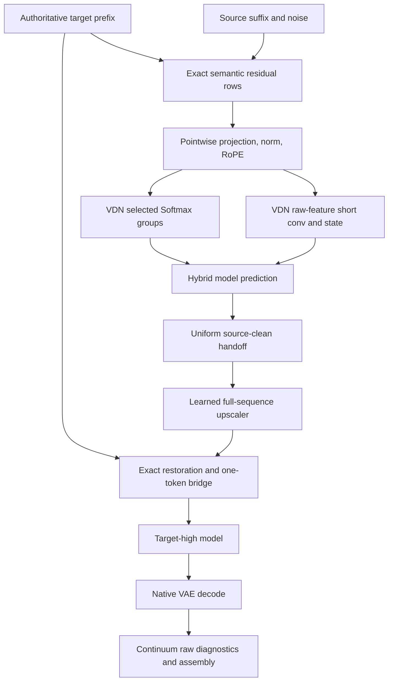

# Heterogeneous exact-prefix boundary: implementation design

Status: **source-audited, hardware-gated design; no production fix implemented**. Audit date: 2026-09-29 UTC. Authoritative repository: `xmarre/MiniMax-H3-Flow-Aligned-Regenerate`. Start point: Flow PR #89, `fa8d65b84e0666ce467b838544d92c801394a002`. Design branch: `design/heterogeneous-exact-prefix-boundary-20260929`. This document is the only intended committed change. Audio remains independently unresolved and is outside this design.

## Decision and limits

Preserve the exact target-grid semantic prefix in the H3 residual stream and the source-grid generated suffix. Do not restore duplicated source-uniform low/probe execution. The leading structural candidate is a **destination-grid spatial stencil for VDN cross-grid temporal taps**, owned numerically by VDN and negotiated by Flow. Map raw projected neighbor features to the receiving frame's H3 lattice before its depthwise spatial convolution, then apply the existing temporal weights, activation, normalization and recurrence. Do not resample the authoritative prefix or change its RoPE.

This candidate is conditional, not an established root-cause finding. Live source establishes an operator mismatch between the current heterogeneous extension and this uniform-stencil extension. It does not establish that the mismatch produces the reported rendered defect. Retrieved hardware history does not contain a controlled current-contract cross-grid-tap suppression or linear-bypass result. The first implementation milestone therefore uses the existing discriminator, plus bounded observation of actual feature components. Promotion requires the candidate to resolve the rendered geometry across the entire boundary window while retaining the exact-main background benefit.

There is a second material issue: the latest run is not clean over the whole pre-high window. Its one-token structural bridge makes the first pair look clean while the next pair is strongly displaced. A successful VDN intervention must survive that existing handoff path; otherwise this design cannot be called a complete fix. No new output-space actuator is authorized by this specification.

Flow remains the authoritative coordination owner because it owns prefix semantics, representation transitions, sampler/history lifetimes and acceptance. VDN is the conditional arithmetic owner. Sol, Continuum, Core and the learned upscaler do not receive production changes for this candidate. Their ownership must be revisited only if the specified discriminator implicates them.

## Verified source and review baseline

These refs were fetched live, rather than accepted from the task's snapshot. Links below are primary sources. A branch/release name is not proof of installed code.

| Repository / role | Audited ref | Base / relation |
|---|---|---|
| [Flow #89](https://github.com/xmarre/MiniMax-H3-Flow-Aligned-Regenerate/pull/89) | `fa8d65b84e0666ce467b838544d92c801394a002` | main/base `a6249b8343becc1458a4555d2bb25cd523983c90`; draft, one commit ahead, zero behind |
| [VDN Plus #33](https://github.com/xmarre/ComfyUI-VDN-H3-Plus/pull/33) | `da3627f85d494bdf4213251deb3ba2a94b8a2f36` | main/base `b78e94d0365ffc5059924a048af707e565d0380e`; draft, one commit |
| [Sol main / v0.1.6](https://github.com/xmarre/ComfyUI-Sol-H3/tree/bef9b300275a89290ca2d53eafff79af06f5e0ef) | `bef9b300275a89290ca2d53eafff79af06f5e0ef` | Flow pins `93b3e03f2b7b579aaf55fa0f87f55083b259e25c`; differences to main are release metadata, not runtime source |
| [Continuum Plus #36](https://github.com/xmarre/ComfyUI-H3-Continuum-Plus/pull/36) | `9ea1e75b2ddf8a3cb2a30e26c369aa63c0a32aea` | main `e870875b1a29968d39d72ba304e9f2b05544c015`; nine-commit rejected diagnostic branch; rigid production actuator disabled |
| [Continuum Plus #35](https://github.com/xmarre/ComfyUI-H3-Continuum-Plus/pull/35) | `28624d2577a62b6b48a04f3897e7b03a12697eb7` | rejected exact-decoded-overlap diagnostic; one commit |
| [Learned upscaler](https://github.com/xmarre/Comfyui_Minimax_h3_latent_Upscaler/tree/620165a311de9b28a36260219fb5cd370a304e3c) | `620165a311de9b28a36260219fb5cd370a304e3c` | matches Flow source pin |
| [Core current main](https://github.com/Comfy-Org/ComfyUI/tree/9d80841aa1990305cc7a280c5ea505f317efcc2d) | `9d80841aa1990305cc7a280c5ea505f317efcc2d` | inspected separately from the pinned models below |
| [Original OpenVDN oracle](https://github.com/OpenVDN/vdn-minimax-h3/tree/b8cb28fbfca0266d1c7742a9f25ab8b58191de97) | `b8cb28fbfca0266d1c7742a9f25ab8b58191de97` | VDN CI oracle pin |

Flow's workflow pins Core `1af040bf022569d7a890241c8dd79b296cda483f`, native-mask Core `421a1c245c682c04d4325ba365f40c834c66f5b0`, Spectrum `beb32dd210ef9e95520453107f158241d4f2ecf3`, legacy Continuum `bf25353d8bec44afea22c89717c4301ce13c2036`, DiffAid `ba9d9efbcf7e64c755e068cb76547d8cc85481eb`, RefDelta `034e4c4c14c56bf76813cee4765e7164b0c7e0db`, Untwist `299d4c56a3f057a97b3140d2136189bcd1e7d6bb`, legacy VDN `1fc9d0d979683e3410587fac17358d3dd583e551`, and the Sol/upscaler/VDN Plus refs above. VDN's native CI uses Core `6c53f8c9a06d95f3d847009ceaae55c624169247`. Those different pins are deliberate audit inputs, not interchangeable installed provenance.

The Core spatial/time constructors are unchanged across the inspected pins and current main. Current main adds attention-backend and mallocgraph plumbing, including a block `attention` keyword, which must be accounted for separately in compatibility fixtures.

Reviewed repositories' instructions were read. No production branches, PR heads or rejected-evidence branches were changed. A remote source checkpoint, `checkpoint/heterogeneous-boundary-source-audit-20260929`, points to the starting Flow head. The separate design branch also starts there. All source checkouts and experiments were isolated from the protected PRs.

| Existing exact-head evidence | Observed result |
|---|---|
| Flow CI run `36617015434` at `fa8d65b…` | source contracts and Python 3.10–3.13 checks successful |
| VDN CI run `35826859427` at `da3627f…` | pinned Core / official oracle, current Core smoke and migration successful |
| Continuum #36 CI run `36627637230` | publisher / Python checks successful; this is not media acceptance; automatic review skipped |
| Flow / VDN review threads | old functional threads resolved/outdated; no outstanding retrieved threads. VDN's repeated-grid temporal-tap omission and low-precision beta-opmath issues had been addressed |
| Sol main check-run page | returned publish checks were skipped; no exact-head all-tests-green verdict inferred |

### Installed provenance remains incomplete

The original 00717 log identifies ComfyUI `0.37.0`, `v0.37.0-61-g34b50ec9 on patcher/stack`, Python 3.12.13, Torch 2.10+cu130 and SM120 RTX PRO 6000. The public Core clone did not resolve that abbreviated installed commit. The log does not provide loaded-module hashes, a complete Patcher overlay graph, or the full upscaler state-dict architecture. Consequently this audit cannot prove that every installed file equals a CI pin, even where receipts agree with source.

Before a hardware comparison, capture full Core SHA, each custom-node base/overlay ref and effective tree, loaded `__file__` paths and SHA256s for audited modules, model/VDN/upscaler checkpoint hashes, VDN configuration, Sol tau/routing policy, precision/TF32 settings, Spectrum settings, workflow JSON, seed/noise identities and relevant environment switches. Record DoRA/LoRA effective strengths and their provenance. Pin the comparison to this manifest. Reject a supposedly matched A/B if effective source or configuration differs unintentionally.

## Causal evidence, including what it does not prove

### Semantic and source-uniform contrast

[00684](https://github.com/xmarre/MiniMax-H3-Flow-Aligned-Regenerate/pull/89#issuecomment-5850366587) used source-uniform primary execution despite outer exact-partitioned controls: six source-uniform calls, zero exact-context calls. Its cabinet/curtain continuity was wrong. [00686](https://github.com/xmarre/MiniMax-H3-Flow-Aligned-Regenerate/pull/89#issuecomment-5851058310) made the exact target prefix real transformer context: five exact calls, zero primary source-uniform calls, no resizing of that prefix for the transformer. The reported background became consistent and the shift returned. This is positive evidence for retaining exact-main semantics, not proof that any one heterogeneous operator caused the shift.

[Flow #62 / 00561](https://github.com/xmarre/MiniMax-H3-Flow-Aligned-Regenerate/pull/62#issuecomment-5754113062) selected source-uniform shadow low/probe clean video for transfer while retaining the exact-main trajectory; the reported raw decoded frame shift disappeared. [#68 / 00573](https://github.com/xmarre/MiniMax-H3-Flow-Aligned-Regenerate/pull/68#issuecomment-5764117810) retained main+shadow execution and continuous PT212, but semantic transition happened early (around frame 186 rather than 191/192). Its [timing receipt](https://github.com/xmarre/MiniMax-H3-Flow-Aligned-Regenerate/pull/68#issuecomment-5764520133) was 430.62 versus 221.85 seconds, approximately 94.1% extra. The duplicated class had five sampler lifetimes / four history boundaries, versus the current continuation's three / two. Source-uniform shadows are an oracle for numerical representation, not a production candidate. They also changed AV/guidance state, so they are not an isolated test of VDN stencils.

### Handoff and target-high

[00689 same-source control](https://github.com/xmarre/MiniMax-H3-Flow-Aligned-Regenerate/pull/89#issuecomment-5852809642) changed only transfer of a source-clean tensor: upper45 displacement was about `(+0.129,+0.067)` target cell for the spatial control versus `(-0.102,+0.690)` for learned transfer; full-frame estimates differed in another direction. The learned provider contributes to representation change. This does not prove sole causation, nor exonerate later model computation.

[00712](https://github.com/xmarre/MiniMax-H3-Flow-Aligned-Regenerate/pull/89#issuecomment-5879343125) first-pair upper45 pre-high Y was about +0.05551 cell, final +0.09816; full-frame pre-high −0.00231, final +0.18363. [00713](https://github.com/xmarre/MiniMax-H3-Flow-Aligned-Regenerate/pull/89#issuecomment-5881642918) first actual high prediction already had upper45 Y +0.12947 / full +0.22219 before Flow guidance, with little change after guidance. This localizes a response inside the high model, but does not distinguish an independent high-stage cause from amplification of inherited discontinuity. Phase-correlation displacements are proxies, not complete geometry or causal measurements.

### Original 00717 artifacts correct a first-pair-only interpretation

00717 uses prefix_t=12, temporal=62, target latent 48×48 (patch grid 24×24, 576 rows/frame) and source latent 34×34 (patch grid 17×17, 289 rows/frame). There are 6,912 exact prefix and 14,450 suffix video rows. Receipt mode is `normal`, with five actual exact-partitioned calls. Whole-workflow counters cover two chunks: six sampler invocations / four history boundaries, not six lifetimes for one continuation; actual total H3 NFE is 14 (low 8, probe 2, high 4), logical calls 18 with four forecasts.

Selected upper45 trajectories below are target-equivalent cells. Pair 0 crosses the carried prefix boundary; pair 1 is the first-generated to next-generated transition.

| Stage | Pair 0 dx,dy | Pair 1 dx,dy | Pair 2 dx,dy |
|---|---|---|---|
| source low native | −0.49326,+0.20884 | −0.20114,−0.08397 | −0.18878,−0.11273 |
| learned native | −0.58891,+0.37700 | +2.98556,−0.65715 | +1.49098,+0.01054 |
| exact restored pre-high, including one-token bridge | −0.02102,+0.01035 | **−3.89833,−3.80939** | +1.49098,+0.01054 |
| final post-high | −0.03188,+0.07941 | −0.28420,+0.11755 | −0.18007,−0.01102 |

The bridge receipt is `weights=[1.0]`, `corrected_tokens=1`, `suffix_representation_bridge_successor_safe=false`. In current source that label is inferred from support length, not a measured continuity proof; even a true label would not establish media safety. Exact restoration and one-token actuation clean pair 0 while substantially changing pair 1. It is incorrect to call this entire pre-high window clean or to infer independent high-stage causation from pair 0 alone. The source-low values also do not prove current source-uniform equivalence because no matched uniform witness was supplied.

Raw decoded PT212 precedes Continuum's rigid mutation:

| ROI | Pair 0 dx,dy px | Pair 1 dx,dy px | Pair 2 dx,dy px |
|---|---|---|---|
| upper45 | −6.05377,+4.09799 | −0.09113,+4.34727 | +0.00409,+0.17390 |
| full | −6.57798,+4.38918 | −0.05791,+0.05723 | −0.02484,+0.09021 |

The upper region continues vertical motion on pair 1 while the full estimate does not. PT224 local affine estimates are low confidence; they motivate local geometry tests, not a proven global zoom. PT216 ordinary seam patches were not producing the raw defect. [Continuum's 00717 receipt](https://github.com/xmarre/ComfyUI-H3-Continuum-Plus/pull/36#issuecomment-5898422393) applied `(+6.2813,−4.2614)` px to 170 frames and improved its selected phase metric by 96.19%, but the reported rendered defect remained. The original rendered MP4 was not available to this CPU audit; media outcome here is the user's reported outcome recorded in primary PR history, not independent viewing.

### Rejected / bounded conclusions

| Candidate / evidence | What is ruled out or bounded | What remains possible |
|---|---|---|
| Continuum #35 / 00617 exact carried decode, five-frame reuse | Missing VAE right context / independent terminal decode is not a sufficient explanation of this reported artifact | VAE can expose or reshape upstream latent defects; temporal decode context remains a valid general contract |
| [00687](https://github.com/xmarre/MiniMax-H3-Flow-Aligned-Regenerate/pull/89#issuecomment-5851482198) global suffix gauge, applied `(−0.4375,−0.375)` cell and registered guidance | One global suffix translation does not solve the defect | Local geometry / feature mismatch upstream |
| 00713 scalar post-high Y release, latent metric +34.3%, rendered upper Y about +2.0162 px | Tested scalar correction and its acceptance metric are incomplete | Upstream vertical effects are not generally falsified |
| [00714](https://github.com/xmarre/MiniMax-H3-Flow-Aligned-Regenerate/pull/89#issuecomment-5882259726) one-token native high guard | Exact protected token only moved the discontinuity to the free frontier | Ownership/representation mismatch spanning several generated tokens |
| [00715](https://github.com/xmarre/MiniMax-H3-Flow-Aligned-Regenerate/pull/89#issuecomment-5882937232) per-call model prediction gauge | Executed residual RMS about .00139, max .00622; decoded ~2px Y survived. This additive prediction-prefix mismatch was not dominant in that run | High model's nonlinear response to inherited state |
| [00716](https://github.com/xmarre/MiniMax-H3-Flow-Aligned-Regenerate/pull/89#issuecomment-5896918420) VAE-window plateau | Did not apply: target-high-added upper/full Y +.06906 / +.32495 cell disagree. One coherent scalar ROI correction premise fails | Not end-to-end falsification of every context-aware architecture |
| Continuum #36 / 00717 whole retained segment rigid gauge | Applied as designed, own metric +96.2%, media failed: neither whole-chunk translation nor first-pair phase acceptance suffices | Spatially nonuniform and multi-frame behavior |
| 00707 broad clean/reference mutation | Four-token structural + high clean anchor caused ~16px regression; runtime did not match the then-current one-token source head | Does not falsify all semantic conditioning; forbids resurrecting broad four-token anchoring/blending without new contrary evidence |
| Source-uniform only / duplicated oracle | **Not falsified**: useful positive causal contrast | Unacceptable production semantics / topology; selectively recover numerical property instead |

## Reconstructed pipeline and ownership



The graph identifies competing causes, not an established causal chain from F to the visible defect. Existing evidence excludes M's rigid mutation and insufficient right-context reuse as complete solutions. It does not isolate E from F, H/I from J, or inherited state from K.

### Flow / native H3 semantics

At the audited Flow ref, `h3_flow_regenerate/partitioned_stage.py:PartitionedStagePlan` clones the exact prefix and its noise. The sampler tensor remains a uniform source-grid carrier. `partitioned_carrier_layout` preserves native non-video rows and replaces video geometry; `partitioned_positions` uses native target `_video_grid` for prefix rows and the source grid's **full timeline sliced after prefix_t** for suffix rows. Temporal phase is not restarted.

`partitioned_transformer.py:partitioned_diffusion_wrapper` injects patchified exact prefix at layer zero, with native `0.999 * prefix + 0.001 * prefix_noise` conditioning augmentation and the existing shared video projection. Exact semantic hidden rows then evolve normally through the model. “Exact prefix” means authoritative clean latent ownership and native conditioning, not immutable hidden features. Generated suffix remains source-grid. Prefix model outputs are discarded/zeroed for the carrier; sampler/caller ownership restores authoritative values. Modulation segments and non-video/reference origin handling remain native.

Shared QKV projection, channel normalization, MLP, residual additions and RoPE are pointwise across rows. They do not first mix prefix and suffix by themselves. Attention does. VDN snapshots raw projected video Q/K/V before in-place QK normalization/RoPE; its linear feature branch operates on those raw views. Inherited Softmax preprocessing occurs once after QK norm/RoPE, before selected gathers; it is not applied again inside the linear branch.

`partitioned_scheduler.py:run_partitioned_progressive` owns low, probe and target-high lifetimes. Low/probe exact context is carried by a stable `PartitionedStageRuntime` leaf, including provider ownership/history identity. Source-clean prefix restoration uses `resize_spatial_5d_h3_patch_lattice`, separately mapping the four sub-patch latent features on H3 coordinates. It is not generic half-pixel bicubic. Source and target representation changes are explicit transitions; neither may silently replace exact semantic context.

### Physical lattice and density derivation

For patch grid `(h,w)`, let `a=sqrt(h*w)`. Core `_axis_from_sqrt_area` / `_frame_grid` produce:

`y(i)=16*(1-h/a) + 32*i/a`, `x(j)=16*(1-w/a) + 32*j/a`, for `0<=i<h`, `0<=j<w`.

This is an area-normalized endpoint-excluded lattice, centered in the nominal frame. Nominal cell area is `1024/(h*w)`. For 24×24 versus 17×17, stride is 1.33333 versus 1.88235 in H3 coordinate units. Native temporal coordinates use `(1,4,4,4,4)` repeating spans, scaled by `5/3`, with exclusive cumulative positions and preserved origin. A uniform `t*constant` replacement is invalid.

To preserve relative physical integration measure, choose source-cell units. Prefix token weight is `mu=source_rows/target_rows` (00717: `289/576`), suffix weight 1. For equal nominal extents this yields equal total measure per frame. It is an approximation for finite sampled feature fields, not a theorem that learned heterogeneous computation equals uniform computation.

VDN applies this factor to beta-weighted **both** `A=sum beta*k*k^T` and `B=sum beta*v*k^T` frame statistics. Its frame-mean alpha input is already a per-frame mean in FP32; a constant within-frame measure cancels in a normalized mean. The state update includes `(I+A)^−1`; raw target token counting would change nonlinear state saturation, not merely brightness. Token RMS readout, pointwise output gates, projections and residual additions are not spatial sums and do not acquire a density multiplier just because a grid changes. Their feature calibration may still be affected empirically.

Grouped Softmax also receives prefix log key measure: `log(mu)` added to prefix K logits, giving weights proportional to `mu*exp(qk*scale)` relative to source keys. This preserves quadrature weighting of the same continuous kernel under ideal sampling. It does not restore lost high-frequency information, equalize Q distributions, guarantee sparse router selection, or prove checkpoint calibration. The `raw_token_measure` diagnostic is a perturbation, not a correct production policy; its handling of special anchor cases must be read rather than presumed to remove every weighting identically.

Thus the current heterogeneous representation is geometrically coherent and measure-corrected at audited spatial sums, but **not proven distribution-equivalent for a uniformly trained H3/VDN checkpoint**. No missing universal density multiplier has been established. Convolution resampling, nonlinear features, state conditioning and sparse selection are the remaining calibration mechanisms.

### VDN grouped Softmax and Sol

`vdn_h3/partitioned_grouped.py` owns exact frame/window selection, global/anchor behavior and prefix/suffix Q groups. Groups preserve selected K/V frame domains even when Q and K counts differ; global/anchor rows are not arbitrarily expanded. Target-prefix Q uses dense execution; suffix groups can use sparse execution. Exact prefix sinks and physical key bias are transported as one union.

`query_positions.py` maps gathered Q positions to their correct restricted K/V ordinals. The current provider-v4 wire is `("vdn_query_positions",1,owner_generation,plan_digest,group_index,q_rows,kv_rows,sink_rows,query_position_runs)`. Preflight and actual execution use the same selected plan; generation, digest and row counts validate identity. This fixes rectangular-row identity, not physical calibration.

Sol `sol_h3/partitioned_request.py:partitioned_request_attention(q,k,v,options,*,block_index,kind,scale,sink_rows,prefix_k_range,prefix_log_key_measure,semantic_digest,query_position_map=None,force_dense=False)` executes that already-selected domain. Prefix bias is FP32. Its all-selected arithmetic gate compares `_sm120_union` to `_weighted_dense` on the first actual layout, before ordinary tau-based sparse use. That proves arithmetic agreement in the all-selected case, not quality of sparse selection. `mapped_neighbors.py:compile_descriptor` compiles affine Q runs into at most four contiguous K64 block intervals with ordinal ±1 neighbors; these are provider block neighbors, not a proof of equal physical neighborhoods at different densities.

Fragmented/unrepresentable maps must not be replaced by their hull. General retained provider-v4 handling can call native restricted attention on invalid mapping; direct partitioned Sol `_descriptor_for_wire` raises `RuntimeError` for `MappingUnavailable`. Do not conflate those paths, silently downgrade to v3, or broaden attention to make a descriptor fit.

The requested `docs/SOFTMAX_PROVIDER.md` exists in **VDN Plus**, not the audited Sol repository. Sol's live API above and mapped-neighbor tests are the source of truth. An older Sol commit `93480d7` contained `SOL_H3_FORCE_DENSE_PARTITIONED_SUFFIX_DIAGNOSTIC` and replay tooling; neither exists in audited main/pin. Do not prescribe that environment switch as a current capability. A needed narrow dense diagnostic must use the existing `force_dense` argument under a newly isolated diagnostic/history identity.

Sol can still introduce a boundary-specific sparse approximation error even with correct maps. It is a secondary controlled hypothesis. No production Sol API or routing change is justified by present evidence.

### VDN linear features: the first explicit stencil mismatch

At `partitioned_linear.py:_variable_features`, the released default branch applies spatial depthwise 5×5 and temporal five-tap convolution to K and V; Q is SiLU + L2 without short conv unless a checkpoint explicitly requests it. Current implementation:

1. Spatial-convolve each raw frame on its native grid, with zero padding.
2. For a temporal neighbor on another grid, `_map_temporal_neighbor` maps that **already spatially convolved** field to the receiving grid.
3. Sum signed trained temporal taps, then apply SiLU once; L2-normalize Q/K after the sum. V is not L2-normalized.
4. Compute token gates and per-frame measured statistics, existing alpha/text bridge and recurrence, existing readout and separate output projection.

The mapper's direction is correct: destination physical coordinates are converted to fractional source indices. It uses explicitly constructed grid-sample coordinates, bilinear FP32 interpolation, border extrapolation and dtype restoration; `align_corners=True` is the encoding of those explicit coordinates, not generic endpoint-aligned resizing. Same-grid mapping is identity. Degenerate axes are handled. High-to-low interpolation is not bandlimited/conservative; border extrapolation and prior source-grid zero-padded convolution are distinct boundary operations. Mapping before activation/norm is preferable to mapping normalized/activated features, but a raw learned feature need not be a smooth resolution-invariant field.

Let `M_(d<-s)` be that physical mapper, `C_g` the trained spatial stencil on grid g, and `w_o` a temporal tap. Current cross-grid contribution is `w_o M_(d<-s)(C_s f_s)`. A destination-frame stencil is `w_o C_d(M_(d<-s) f_s)`. In general:

`M_(d<-s) C_s != C_d M_(d<-s)`.

The trained kernel has token offsets, so its physical offset changes with grid stride. Native-domain filtering then interpolation gives the receiving temporal sum contributions with different physical stencil scales. Mapping alone does not fix that operator discontinuity. Nonlinear activation/state updates prevent a general scalar correction afterward.

A CPU experiment using actual audited VDN helpers, a smooth `sin(.4*y)+cos(.6*x)` field on 24×24 mapped to 17×17, and one left-offset unit spatial tap gives preactivation max absolute difference **.31970268**, interior RMS **.21955100**. This proves noncommutation, not learned-artifact causality. Tests comparing batching to the existing scalar reference cannot discover this issue because both encode the same ordering.

The VDN paper ([Video DeltaNet](https://arxiv.org/abs/2609.20744), equations 3b/4/5 and short-conv/calibration discussion) establishes the uniform trained branch and nonlinear measured state update, not a unique correct heterogeneous extension. The supplied Sol-Attn/VSA/Sol-engine papers concern sparse acceleration; Spectrum concerns prediction forecasting; DMD2 concerns distillation. None validates this new mixed-grid stencil or supplies hardware acceptance for it.

### Learned provider and exact restoration are separate owners

Flow uses upscaler API1 `upscale_clean_video(video,target_h,target_w)` through `handoff.py:validate_learned_upscaler_provider` / `build_handoff_state`. It passes the full source-clean sequence, including restored source-grid prefix. The API has no prefix boundary or semantic-ownership parameter. Source suffix and restored prefix have uniform geometric spacing at this point but may have different semantic feature distributions.

At upscaler `nodes/minimax_h3_latent_upscaler_3d.py:LatentResizer3D`, audited defaults include 3×3×3 entry/exit convolutions, 12 residual blocks on each side of resizing (two convolutions each), and temporal depthwise kernel5 + pointwise mixing every two blocks. Internal interpolation is trilinear `align_corners=False` on learned latent indices, preserving T. **Do not replace this trained interpolation with H3 RoPE mapping without evidence**: they represent different learned contracts. Attention was forced off in the supplied runtime; temporal modules were enabled. GroupNorm on `[B,C,T,H,W]` computes group statistics across the entire temporal/spatial volume. Therefore its temporal dependence is global even with finite convolutions. The default convolution-only radius is 74 latent tokens (`2+2*(12+12)+2*(6+6)`), but actual checkpoint architecture must be reconstructed; a five-token local replay is not equivalent to this provider. Log checkpoint name: `minimax_h3_latent_upscaler_3d_bf16.safetensors`, 345,280,216 parameters, bf16 CUDA.

`representation_bridge.py:apply_suffix_representation_bridge` transfers structural plus DC residual from an actual provider boundary pair to exactly the first generated token; it does not extrapolate to later suffix. It preserves prefix ownership but does not guarantee successor continuity. The 00717 next-pair receipt demonstrates why acceptance must cover it. Retain current active behavior while isolating the VDN intervention; do not extend/fade that bridge to repair a new metric. Source-residual noise transport remains `source_residual_patch_refinement_v1`.

Target-high then receives a uniform target-grid sequence with exact prefix/mask ownership. Its immediate prediction can respond to a representation discontinuity; the source evidence cannot decide whether it also creates an independent defect. Native VAE's pinned boundary decode uses seven-latent clips advancing five with two overlap; prefix_t12 puts the boundary in `[10,17)`. Continuum `v3/assembly.py:assemble_decoded_chunks` PT212/PT224 measure decoded chunks before seam/rigid patching; assembly is downstream. Preserve trim/context/overlap contracts, rather than changing decoder windows for this candidate.

## Architectural answers and unresolved questions

| Question | Conclusion supported by this audit | Remaining discriminator |
|---|---|---|
| Earliest causal producer versus source-uniform oracle? | Earliest unresolved class is heterogeneous low/probe attention/linear mixing. Earliest directly observed stage differences include learned transfer and exact restoration; current paired tensors cannot establish the earliest causal producer | Actual-feature witnesses plus matched suppression; no claim that phase telemetry proves VDN causation |
| First information mixing? | Softmax and VDN temporal/state operations mix frames; pointwise shared residual/QKV operations do not | Isolate linear taps, then other linear state / sparse Softmax if required |
| Uniform-trained representation valid? | Coordinates and relative measure are coherent; distribution/operator equivalence is unproven | Candidate versus trained uniform oracle, then media |
| Measure elsewhere missing? | Applied to linear A/B and Softmax key mass; normalized means cancel constant cell measure; pointwise gates/norm/residual have no integration factor | Nonlinear feature and sparse calibration, not arbitrary density scaling |
| Cross-grid feature transport correct? | Coordinates/direction/preactivation ordering are correct; native spatial filtering before transport is not destination-stencil equivalent | Suppression plus destination-stencil trial; aliasing/borders separately inspected |
| Grouped Softmax equivalent? | Same selected ownership and corrected key measure; not guaranteed finite-sample/sparse equivalence | Weighted-dense suffix diagnostic restricted to identical selected domain |
| Can numerical and semantic carriers separate? | Yes, inside short conv only: ephemeral mapped raw features, exact semantic residual rows untouched | No proof yet that this recovers the oracle's useful property |
| Fix ownership? | Flow coordination, conditional VDN arithmetic; no current basis for Sol/Continuum production changes | If discriminator fails, record owner/design deviation before editing another mechanism |

Unresolved hardware questions are narrowly bounded: whether cross-grid taps materially contribute; whether the destination-stencil candidate resolves them without degrading background; whether residual defect is in sparse routing, learned full-sequence transfer, restoration frontier or high response; and actual runtime/checkpoint equivalence. This design does not promise that one conditional edit will resolve all of them.

## Minimal discrimination before production implementation

### Observation-only witness

At the first actual low-stage VDN block with a mixed temporal window, capture one bounded boundary component witness: raw projected K/V for the affected frames, native-filtered K/V, mapped temporal contributions, activated/L2 features, and per-frame A/B/alpha norms. Reuse the current diagnostic recorder and actual invocation. Do not feed a shadow result into model output, repeat a whole H3 evaluation, or create a sampler/history boundary. Compare both operator orderings on this same input offline or in a diagnostic-only component calculation. This answers whether the actual checkpoint/input has the predicted stencil mismatch and which ROIs/channels carry it. It does **not** establish rendered causality. Extra component arithmetic/copies must be accounted for and default off.

Also reuse existing stage/content/prediction observers to distinguish: low clean before source-prefix restoration; after restoration; learned output; exact target restoration before and after the existing one-token bridge; first actual high prediction before/after guidance; final high. For each retained window use four or more consecutive pairs and 4×4 regional correspondences, plus hashes of untouched owners. Existing phase metrics are supplementary. Store bounded CPU witnesses when needed. Optional offline VAE/provider replay is explicitly extra diagnostic work, not zero-call production telemetry.

### Existing causal interventions (not observation-only)

Run A: current normal exact-main baseline with rejected Continuum #36 actuator disabled. The 00717 patched final output is not that baseline. Reuse its raw evidence only where provenance and stage are matched.

Run B: same frozen workflow using the existing VDN mode `suppress_cross_grid_temporal_taps`; keep exact semantic prefix, source suffix, audio settings, learned provider, bridge, Sol/Spectrum and seeds fixed. Current live diagnostic strings are `normal`, `bypass_partitioned_linear`, `suppress_cross_grid_temporal_taps`, `raw_token_measure`. Verify actual runtime receipts rather than control labels. Retrieval of the relevant PR history found no controlled current-contract suppression/bypass hardware result; do not infer such a result from the existence of tests.

Suppression changes computation and output; it is a **diagnostic intervention**, not an output-neutral observer or production answer. Separate runs consume experimental compute, even though each preserves per-run NFE/topology. If B materially removes/changes the top geometry while retaining the background, implement and test the destination-stencil candidate C. B's success only implicates cross-grid taps; it does not prove that changing ordering is sufficient.

If B does not discriminate, use existing `bypass_partitioned_linear` as a separate conditional control. If bypass changes the defect, inspect measured frame writes, gates and state recurrence before selecting any new architecture. If neither linear intervention changes it, use `force_dense=True` for suffix groups **within the same gathered domain and prefix bias**, under a distinct diagnostic/history identity; do not force global model attention or resurrect an absent environment switch. This tests sparse selection, not grouped ownership. Stop the stencil promotion path if evidence contradicts it.

If learned transfer remains implicated, capture the one actual full source-clean provider input with complete provenance and replay it through the actual learned checkpoint and the existing spatial control. Any additional provider or VAE replay must be diagnostic-only, counted, and external to production execution. Do not crop temporal context as an optimization because GroupNorm is global. Source-uniform-only can be a diagnostic oracle without duplicated shadow production, but semantic loss and AV/guidance changes must be recorded as confounds.

Minimum initial hardware work is matched A+B; C is conditional. Do not launch all arms or a broad benchmark campaign automatically. If A/B/C cannot isolate or remove the defect, document the result and revise this design before another production correction.

## Conditional implementation specification

### Numerical data flow

For receiving frame d and temporal neighbor s, with raw pre-RoPE projection `f_s` of shape `[rows_s,heads,head_dim]`:

* Same grid: use the existing native batched spatial convolution `C_d(f_s)` and existing temporal accumulation, including same-grid frames in noncontiguous runs.
* Different grid: reshape raw `f_s` to `[1,C,h_s,w_s]`, use the existing physical mapper to destination `(h_d,w_d)` in FP32 with border extrapolation, cast to the same feature dtype, then apply the existing trained depthwise spatial weight with zero padding on destination grid. Multiply by the same temporal tap and accumulate in the existing precision/order.
* Apply SiLU only after the temporal sum; apply L2 once for the existing requested Q/K branches. Preserve V behavior. Do not interpolate normalized K, apply RoPE to the linear carrier, reweight signed convolution taps by token density, or modify authoritative latent rows.

Use current geometry and extrapolation first; changing antialiasing/border policies simultaneously would destroy the discriminator. Record their finite-sample limitation. If the actual checkpoint requests Q short conv, use the same generic policy for Q; do not hardcode K/V-only assumptions.

The mapped carrier is an ephemeral numerical view for this convolution only. Its row ownership is the receiving frame; it is never inserted into H3 residual rows or sampler latents. No change to prefix/suffix Q/KV gathered rows, prefix key measure, per-frame statistic measure, temporal phase, text bridge, gates, recurrence, readout, or output projection. Preserve skip-end anchor behavior and inner-frame indexing in `_core_readout`.

### Proposed contract (new, not an existing API)

Keep Flow exact-prefix contract `h3_flow_partitioned_exact_prefix_v1`, external VDN sequence API4/mode `partitioned_attention_variable_grid_linear`, and Sol provider-v4 wire unchanged. Add an independently versioned Flow-to-VDN **numerical policy** leaf `h3_flow_partitioned_vdn_temporal_carrier_v1`:

```
api: 1
policy: native_grid_then_map_v1 | destination_grid_stencil_v1
flow_semantic_digest: existing exact-prefix plan digest
numerical_digest: hash(api, policy, plan digest, diagnostic mode,
                       checkpoint short-conv specification,
                       precision/mapping policy)
```

These identifiers and fields are proposed here; implementers must not pretend they are already supported. VDN advertises/validates capability before sampling. No tensor data lives in the wire. Diagnostic selector and policy are captured once per stage. Owner generation remains stage-local and is separately checked; deterministic digest must not include transient object IDs.

Existing consumers with no new leaf retain audited old behavior for rollback/backward compatibility. A request selecting `destination_grid_stencil_v1` requires matching capability and digest; malformed/unknown policy, wrong plan, incompatible weights or missing VDN support raises before sampling. Never silently degrade that selected candidate to old arithmetic, source-uniform semantics, wider dense attention or provider-v3. Native H3 without VDN needs no carrier policy and remains unchanged. During experimentation normal remains the default; promote the candidate default only after all acceptance gates.

Numerical policy identity must bind both Sol numerical-history/Spectrum caches and Flow's stable provider identity. Changing it must force a real actual evaluation under a new identity within the existing stage lifetime, never use a forecast from another policy and never add a new sampler/history boundary. Scope feature caches to one block invocation/projection. Reuse only geometry descriptors across calls; their keys include grid direction/device and precision policy. Do not cache input-dependent mapped tensors across model evaluations.

### Exact file/function work

| Repo / files | Required implementation changes |
|---|---|
| VDN `vdn_h3/partitioned_linear.py` | Add validated policy argument through `partitioned_linear_readout`, `_core_readout`, `_variable_features`, `_heterogeneous_conv_features` and scalar `_heterogeneous_conv_features_reference`. Factor cross-grid raw-map-then-spatial helper. Preserve old reference as explicit rollback oracle, not silently replace its meaning. Keep uniform fast path and existing batched statistic/readout work |
| VDN `vdn_h3/partitioned_runtime.py` | `_resolve_partitioned_linear_runtime`, `validate_partitioned_external_execution`, `_partitioned_vdn_forward`: validate policy/capability, capture raw snapshots exactly once, forward policy, publish bounded actual receipts and diagnostic identity. No extra QKV projection or attention evaluation |
| VDN `vdn_h3/partitioned_sequence.py` | Add numerical-policy validation/capability without changing geometric `PartitionedSequence` meaning or API4 ownership. Keep existing measure and plan digest. If digest serialization changes, add explicit version/migration tests rather than invalidating provider-v4 silently |
| VDN `vdn_h3/retained.py`, `query_positions.py`, `partitioned_grouped.py` | Preserve geometry/native fallback contracts. Tests prove unchanged; only touch identity propagation if required, with a separate reviewed reason |
| Flow `h3_flow_regenerate/partitioned_stage.py` | `PartitionedStageRuntime`: stage-captured numerical-policy and digest fields; immutable selection through a lifetime, no authoritative tensor ownership change |
| Flow `h3_flow_regenerate/partitioned_transformer.py` | `_vdn_external_contract`, `_partitioned_transformer_options`, `_stage_partitioned_attention_override`: publish proposed leaf/capability and bind numerical history/provider identity. Leave exact injection, native positions and preprocessing ownership intact |
| Flow `h3_flow_regenerate/partitioned_scheduler.py` | `_validate_partitioned_vdn_compat`, `_preflight`, `_partitioned_stage_contract`, `_verify_partitioned_vdn_linear_diagnostic`: validate matching actual policy before sampling and record applied execution, not mere requested controls. Add bounded witness selection to existing observation machinery only |
| Flow `h3_flow_regenerate/partitioned_runtime_gate.py` | Validate new policy/digest/actual-call receipts, per-continuation 3/2 topology and zero extra work. Add whole-window successor checks; do not use `successor_safe` support-length label as media proof |
| Flow tests / `tools/check_partitioned_exact_prefix_contracts.py`, workflow source pins | Extend exact contract checks to paired VDN capability and identity; update VDN pin only after mirror qualifies. Separate pinned Core oracle from current-Core compatibility fixtures |
| Flow `handoff.py`, `representation_bridge.py`, high-stage code | No new production mutation. Add observation before/after restoration if needed. Preserve provider API1/source-residual handoff and one-token current baseline during the discriminator |
| Sol / Continuum / Core / upscaler | No production changes for this candidate. Optional narrow dense diagnostic uses existing Sol argument; if adding an arm, separately version its identity and keep it default-off |

Remove no useful diagnostics in this step. Mark rejected production actuators as permanently off under this candidate, with regression assertions; retain historical observation receipts/tests. Do not relabel obsolete gauge tests as fix acceptance. Deprecate support-length “successor safe” as a safety verdict; introduce measured window receipts without broadening production correction support.

### Performance, memory and accounting

For one interior prefix/suffix boundary and temporal radius2, there are six directed cross-grid temporal contributions (1+2 each direction), but only four distinct `(source frame,destination grid)` mapped carriers per projection. Default K/V therefore requires at most eight distinct additional destination spatial convolutions, with per-invocation reuse. Count from actual frame-size sequence/kernel, not a hardcoded six; short domains, repeated grids and skip-end trimming alter this. Cross-grid contributions touch a bounded stencil input window, but state recurrence and transformer attention can propagate their effects through the whole suffix.

Avoid caching all mapped frames or stacking a second full video. Stream one receiving grid/projection at a time and retain only reused boundary carriers within the feature call. Memory upper bound for a fully retained raw mapped carrier set is `sum_(distinct pairs) C*h_d*w_d*element_size`, plus convolution/output workspace and FP32 mapping temporaries; report actual peak instead of a guessed fixed MiB because checkpoint C and allocator behavior matter. Geometry cache is small. Release carriers before recurrence where possible. Same-grid batching stays unchanged.

Production work deltas must be: H3 NFE 0; sampler lifetimes 0; history boundaries 0; duplicated low/probe trajectories 0; learned-provider calls 0; VAE calls 0. Extra short-conv arithmetic is nonzero and must be timed. Record cold/warm block and whole-workflow latency, peak reserved/allocated VRAM and synchronization separately from optional diagnostics. Initial performance budget: median low/probe time ≤5% above the matched #33 stack, no extra full-video allocation, no O(T²) carrier work. This is an engineering acceptance budget, not a measured forecast. If exceeded, optimize reuse/batching without changing the scalar operator; do not trade away geometry/media correctness to retain a timing number.

## Validation required before promotion

### Unit / mathematical oracles

1. Extend `vdn/tests/test_partitioned_linear.py`: independent scalar destination-stencil oracle versus batched code; FP32 and actual bf16/fp16 feature/accumulation tolerances established against uniform trained oracle, finite checks, signed temporal weights, all requested Q/K/V conv combinations and asymmetric kernels. A reference that copies the new helper is insufficient.
2. Uniform grids must route through the old fast path and match the pinned OpenVDN uniform branch within its existing dtype tolerance; where arithmetic path is identical, require exact tensor equality. No “heterogeneous is improved” assertion against an untrained synthetic output.
3. Explicit noncommutation witness as above, identity maps, constant and affine fields on square and rectangular H3 lattices, correct high→low and low→high direction, interior vs border checks, degenerate axes, endpoint-excluded coordinates against Core constructors. No generic half-pixel expected tensor.
4. Temporal edge/short sequences, alternating A/B/A grids, noncontiguous equal-grid runs, prefix boundary near skipped anchors and variable temporal kernel widths: never omit a same-grid cross-run tap or cross-grid required tap. Verify cached and uncached results and actual unique pair count.
5. Preserve `A/B` measured weighting and frame means with independently sampled constant fields: target count change must not simply multiply physical mass; test beta opmath for fp16/bf16. Keep inverse-state/text bridge/readout/gates unchanged when fed identical features.
6. Policy mismatch/unknown leaf/changed plan or weights fail before sampling; absent leaf runs legacy behavior. Same policy owner survives options cloning; policy changes cannot reuse numerical forecasts. Test no cross-call input tensor cache, no stale device/dtype geometry.

### Cross-repo / source contracts

* Run existing VDN partitioned-linear/sequence/grouped/runtime/index-cache/query-position-v4 tests and pinned official linear/hybrid oracle; current-Core smoke separately. Existing batching-equivalence tests remain useful but do not qualify mixed-grid physics.
* Run Flow `test_partitioned_stage.py`, `test_partitioned_prefix.py`, `test_partitioned_prefix_context.py`, `test_partitioned_primary_execution.py`, `test_partitioned_provider_stability.py`, `test_partitioned_sol_preflight.py`, `test_partitioned_runtime_gate.py`, diagnostics/representation/handoff tests, source-contract script and native mask/VAE/mixed-grid oracles at documented pins.
* Run Sol `test_partitioned.py`, `test_mapped_neighbors.py`, `test_partitioned_history.py` and SM120 all-selected weighted-dense gate. Compare old/new group ranges, gathered Q/KV counts, provider-v4 runs/generation/map digest, sink prefix ranges and measure byte-for-byte for the same geometry. Policy identity may differ; ownership geometry must not.
* Exercise two consecutive continuation boundaries, distinct low/probe owners, partial K64 tiles and rectangular Q/K cases. Verify valid fallback stays in the restricted domain, invalid selected-policy capability fails closed and no map is replaced with a hull.
* Assert exact prefix hash/value equality at sampler/caller handoffs, native target-prefix RoPE and source suffix continuous temporal coordinates, one inherited preprocessing pass, source-residual reconstruction, unchanged native masks/audio handoff inputs and no rejected mutation invocation.

Video changes in a joint AV model can indirectly change generated audio. “Audio unchanged” here means no audio algorithms/settings/positions/masks/ownership or direct audio tensor mutation is introduced by this fix; do not promise identical generated waveform or report this as an audio solution. Record indirect audio output differences separately without adjusting audio policy to qualify video.

### Hardware and decoded-media gate

Run matched A/B and conditional C on the actual SM120 stack. Preserve the 00717 scene/background references and settings, including audio selectors, with #36 rigid production mutation disabled. Capture both raw and assembled decoded video and complete manifest/log/metrics. Do not silently change seed, prompt, guidance, handoff support, Spectrum, Sol tau, VDN checkpoint or camera behavior between arms.

Minimum candidate acceptance includes the original square 17→24 patch-grid case across two continuation boundaries; then one non-square target/source case and meaningful Spectrum enabled/disabled history validation. At each boundary inspect the first retained frame (39 in the pinned prefix12 decode contract), at least 24–40 following retained frames and the entire retained segment at normal speed. Use side-by-side media with annotated boundary positions and fixed top-edge/cabinet/curtain landmarks. Track regional flow/correspondences/local affine geometry and scale/shear across upper, central and lower ROIs over multiple pairs. Reject delayed release-frontier jumps, top expansion, freeze, crop-border exposure or compensation drift even if global phase error improves.

Require visually preserved exact-main scene/background continuity, no discrete boundary-only camera/frame change beyond the scene's baseline motion, no new texture/subject instability, and no displaced jump at the second generated token or later window release. Compare quantitative regional impulses to same-scene pre-boundary motion and the matched baseline rather than inventing a universal one-pixel threshold. Phase/PT212/PT224 are corroboration; confidence and native camera motion matter. **User inspection of rendered media is the final hardware acceptance criterion.** Synthetic tensors, a first-pair metric, successful CI or a `successor_safe` label cannot replace it.

If C improves the VDN witness but leaves the provider/restoration frontier or decoded artifact, it is not a complete solution and must not be promoted as one. Check the specified owners separately. Do not add a translation, fade, VAE-window plateau or extra protected token to rescue C.

### Local design-task checks actually executed

This workspace has CPU Torch 2.14.0+cpu and no CUDA/SM120. Results below are source verification, not implementation or media acceptance.

| Check | Result and limit |
|---|---|
| Flow existing partitioned stage/prefix/context/primary execution tests | 12 passed |
| Flow `tools/check_partitioned_exact_prefix_contracts.py --sol ../sol --vdn ../vdn` | OK: `abi=sol-h3-partitioned-single-union-v1`, groups=5, sequence_rows=49 |
| Flow mixed-grid/decode tests against current Core | 38 passed, one failed: legacy toy `MixingBlock.forward` lacks current Core `attention` keyword. This is a fixture/API mismatch, not proven active-path production failure; no production source changed to silence it |
| Sol partitioned/mapped/history selected tests | 37 passed, one blocked by missing Triton import for SM120 compile-key test |
| VDN direct integration collection | blocked by current Core startup dependencies (ultimately missing `transformers`); no successful integration verdict claimed |
| VDN copied, unchanged pure source test modules with namespace import avoiding node startup | 26 passed, one blocked by missing full Core package path for the Core-coordinate import. This verifies arithmetic/contract source only, not node startup or installed runtime |
| Actual VDN stencil noncommutation experiment | max .31970268, interior RMS .21955100, CPU FP32 |

No new tests were added to production repositories. Existing green remote CI remains the integration baseline. Future implementation must run the full required checks in its proper pinned/installed environment; these local limits cannot be converted to “all tests passed.”

## Hostile review and promotion/rollback

* Why this is not another output gauge: it changes the feature operator at mixed-grid numerical coupling, before activation/state updates; it does not infer geometry from a phase metric or warp decoded/clean/predicted output.
* Why it can retain semantic improvement: the exact target prefix and native backbone positions/residual rows remain real model context. Mapping is private to short conv; broad source-uniform semantic replacement is forbidden.
* Why it may fail: receiving-grid filtering is only one plausible extension of a uniform trained kernel. Source-grid filtering may in fact be better calibrated; raw features may not be interpolable; sparse Softmax, recurrence, upscaler/global normalization and one-token restoration may dominate. Suppression success is not sufficient proof of this candidate.
* Why it can explain multi-frame/local behavior: differing spatial stencil scale and boundary padding feed signed temporal taps, nonlinear gates/state, later attention and provider transfer. Their effects can vary by ROI and persist through several frames. This is explanatory compatibility, not a demonstrated causal result.
* Why 00717 is a strong challenge: pair1 pre-high is already bad after the existing bridge. A design that shows only pair0 or first high prediction would repeat the rejected premise. Whole-window observation/media gates explicitly prevent that.
* Why no complete cause is claimed: no current matched uniform/exact/suppressed hardware witness establishes the earliest producer. This is the remaining discriminating experiment, not a reason to install a speculative fix blindly.

Implement on separate Flow/VDN mirrors. Checkpoint remote refs before destructive or hostile work, risky refactors, long test campaigns, accumulated expensive work, squash/rewrite, and final validated state. Keep rollback policy/legacy arithmetic selectable during qualification; policy changes invalidate numerical history. Roll back through paired Patcher overlays to known exact-context normal refs, not to source-uniform-only or rejected repair branches. Source/checkpoint hashes and matching runtime receipts are required after rollback. Never rely on manual user Git surgery.

PR order/topology:

1. Preserve VDN #33 as its existing one-commit batching/performance PR. Develop arithmetic on a separate mirror starting its effective head; submit a separately named draft VDN stencil-policy PR stacked on #33, or rebase it onto main after #33 merges. Do not silently subsume #33.
2. Develop coordinated Flow contract/identity/telemetry on a separate mirror of effective #89. After source tests and hardware acceptance, checkpoint and consolidate the approved Flow changes into **existing #89 with one clean commit above its then-current base**, preserving its intentional topology. Update its description to the final qualified behavior. Do not create a replacement production Flow PR.
3. Sol production history and rejected Continuum #35/#36 remain untouched. No companion production PR is needed there for this candidate. If evidence requires a different owner, document a justified design deviation with causal evidence, invariant effects and updated tests before opening its separate PR.
4. Hand off exact qualified refs and dependency order through Patcher refresh/overlays, complete workflow, provenance manifest, metrics/log/raw+assembled media and outstanding audio status. No production merges or installation changes are part of this design task.

## External / non-git evidence

Paths below were actually materialized during this investigation; they are not invented installed paths. Temporary workspace locations are not a substitute for evidence retention in the next chat.

| Exact path | Contents / significance | Handoff action |
|---|---|---|
| `/workspace/scratch/1477c2a32f7f/evidence/ComfyUI-Sol-H3/metrics_00717_.json` | Original latest metrics, whole-window trajectories/owner/work counters. SHA256 `8abe3148210934d0765b36064108cccfd73e1af08bd313628d30c602ec575add` | Preserve or retrieve original by filename; verify hash and inspect before comparison |
| `/workspace/scratch/1477c2a32f7f/evidence/ComfyUI-Sol-H3/Pasted text(20260929-203040).txt` | Original log: installed environment, raw PT212/PT224 and applied failed PT225. SHA256 `11ac6cfedde9c97ddda976f16fdd8fb46b8cd7c8edc7c59fea125679961c6e52` | Preserve/retrieve and inspect; does not contain full effective-source provenance |
| `/workspace/scratch/1477c2a32f7f/evidence/stencil_noncommutation.json` | CPU actual-helper counterexample; mathematical witness only | Reproduce if needed; may discard after retaining recipe/result below |

PR comment snapshots and extracted paper text are reproducible from the cited sources / originally supplied PDFs; they need not become additional deliverables. No original rendered 00717 MP4 was materialized.

Reproduction recipe for the mathematical witness (source checkout `vdn` at audited #33 head, torch CPU; namespace import deliberately avoids node startup):

```python
import sys, types, torch
from pathlib import Path
vdn_root = Path("vdn").resolve() / "vdn_h3"
package = types.ModuleType("vdn_h3")
package.__path__ = [str(vdn_root)]
sys.modules["vdn_h3"] = package
from vdn_h3.partitioned_linear import (
    _h3_axis_coordinates, _spatial_conv_frame, _map_temporal_neighbor,
)
y = _h3_axis_coordinates(24, 24, 0, device=torch.device("cpu"))
x = _h3_axis_coordinates(24, 24, 1, device=torch.device("cpu"))
field = torch.sin(.4 * y[:, None]) + torch.cos(.6 * x[None, :])
raw = field.reshape(-1, 1, 1)
weight = torch.zeros(1, 1, 5, 5)
weight[0, 0, 2, 1] = 1
old = _map_temporal_neighbor(_spatial_conv_frame(raw, weight, (24, 24)), (17, 17))
mapped = _map_temporal_neighbor(field[None, None], (17, 17))
tokens = mapped[0].permute(1, 2, 0).reshape(-1, 1, 1)
new = _spatial_conv_frame(tokens, weight, (17, 17))
delta = old - new
print(delta.abs().max().item(), delta[..., 2:-2, 2:-2].square().mean().sqrt().item())
```

## Implementation-time assumptions

Re-fetch heads, reviews, CI, repository instructions and source-contract pins. Reconstruct loaded runtime/overlays before trusting these function names, source refs or line numbers. Assert actual short-conv configuration/weights, prefix/suffix plans, provider boundary behavior and effective checkpoint architecture. If source or new evidence invalidates a premise, stop the affected promotion path, record deviation/reason/affected invariants/tests in the design mirror, then proceed with the justified revised plan. Hardware unavailability does not authorize declaring causal/media acceptance; it permits completing source implementation with a clearly marked hardware handoff.

## Separate implementation-chat handoff

Use this document at the exact design commit supplied with the handoff as the authoritative specification. Re-fetch Flow #89/main, VDN Plus #33/main, Sol main/release, rejected Continuum Plus #35/#36/main, learned upscaler and relevant Core/OpenVDN pins before editing. Reconstruct effective Patcher/installed source and checkpoint hashes; do not treat CI pins as installed provenance.

Preserve exact-main semantics and per-continuation three sampler lifetimes/two history boundaries, zero added H3 NFE/provider/VAE calls, native temporal phase, VDN selected domains and Sol provider-v4 mapping. Audio remains separately unresolved. Start separate implementation mirrors. First perform matched normal/cross-grid-tap-suppression discrimination and bounded actual-feature observation. Implement destination-grid stencil only if evidence supports that path; otherwise document the causal/design deviation, affected invariants and revised tests before another production change.

Checkpoint on GitHub before destructive/hostile work, risky refactors, long tests, squashes and after substantial progress/final validation. Run the unit, pinned/native, source-contract, cross-repo, runtime/history and decoded-media acceptance specified above. Preserve/retrieve the original 00717 metrics/log with listed hashes; reproduce the CPU witness if needed. Do not resurrect rigid gauges, broad high clean/reference mutation, extra-token guards, scalar output releases or VAE-window repairs without new evidence explicitly overturning their rejection rationale. Final acceptance requires rendered media across the whole multi-frame boundary, exact background continuity and measured cost.

Expected final topology: VDN #33 preserved; conditional arithmetic in a separate stacked VDN draft PR; qualified Flow changes consolidated into existing #89 as one clean commit after mirror checkpoints; Sol and rejected Continuum branches untouched unless a documented deviation requires a separate companion PR. Finish with exact Patcher refs/dependency order, workflow/provenance, tests/CI, counters/performance, raw+assembled media and the hardware handoff; no manual user Git operations.
